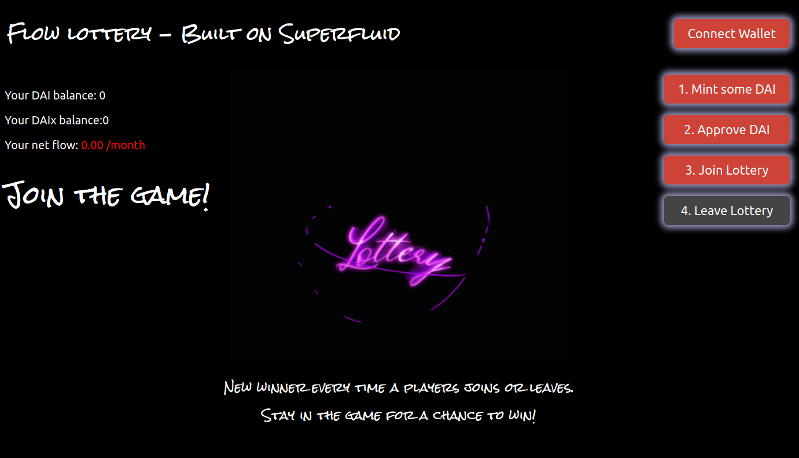

<h1 align="center">Welcome to flowlottery-superapp 👋</h1>
<p>
  <a href="#" target="_blank">
    
  </a>
  <a href="https://twitter.com/Superfluid_HQ" target="_blank">
    
  </a>
</p>

> Example Superfluid App using Constant Flow Agreements

Bootstrapped using [`create-eth-app`](https://github.com/paulrberg/create-eth-app)



## How it works

A game of chance built on Superfluid. Users join the game by sending a stream to our contract. All incoming streams are summed and the resulting reward stream is sent to the winner, until a new one is chosen!

Get a deep dive, including how we built it, in the blog post [Hacking on Superfluid](https://medium.com/superfluid-blog/hacking-on-superfluid-bbb9ade94f98).

### ✨ [Demo](https://flowlottery.eth.link/) on goerli

## Usage

To run the frontend using the deployed goerli contracts, skip the "Install Contracts" section and just run the frontend.

## Install Contracts

```bash
cd solidity-contracts
yarn install
yarn build
```

## Run tests

```bash
yarn test
```

## Run property tests

This project includes property tests based on [Hot Fuzz](../../../packages/hot-fuzz/), which is itself an [Echidna](https://github.com/crytic/echidna) wrapper.  

You can run it with

```bash
npx hot-fuzz contracts/LotterySuperAppHotFuzz.yaml
```

## Deployment

Setup a `.env` file following the example of `.env.template`.

```bash
RELEASE_VERSION=v1 npx truffle --network goerli exec scripts/deploy.js
```

## Install Frontend

> Note: Breaking changes to the JS-SDK means that the UI is currently not functioning properly.

```bash
cd ui
yarn
yarn start
```

## Author

👤 **Francesco Renzi**

-   Website: [https://superfluid.finance](https://superfluid.finance)
    -   Twitter: [@FrancescoRenziA](https://twitter.com/FrancescoRenziA)
    -   GitHub: [@kobuta23](https://github.com/kobuta23)

## Show your support

Give a ⭐️ if this project helped you!

---

_This README was generated with ❤️ by [readme-md-generator](https://github.com/kefranabg/readme-md-generator)_
