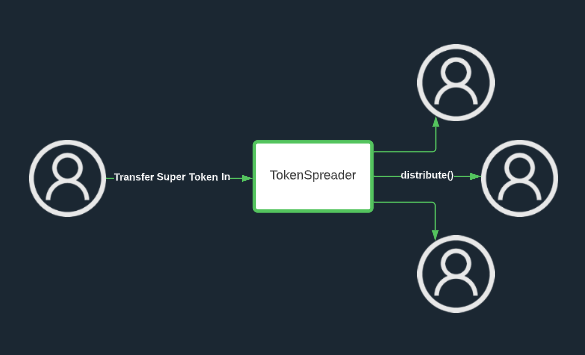

# Token Spreader
 A super simple example of a smart contract that uses Superfluid's Instant Distribution Agreement

 ## What is the Instant Distribution Agreement (IDA)?

 Here's an excellent [**conceptual breakdown**](https://docs.superfluid.finance/superfluid/protocol-overview/in-depth-overview/super-agreements/instant-distribution-agreement-ida) from our docs that thoroughly explains it. Reading through this is a good pre-requisite to trying out this example.

 But, for a bite-sized ELI5...

In an IDA, an account (the "publisher") can send Super Tokens to any amount of receivers (called "subscribers") on a proportional basis with *fixed gas costs*.

Basically, the publisher gives distribution units to these various subscribers. The more distribution units a subscriber has, the more of the distribution it will receive.

For instance, if there were 3 outstanding units, 1 held by account A and 3 held by account B, then if 100 USDCx were sent out, then account A would receive 25 USDCx and account B would receive 75 USDCx.

## What does the Token Spreader do?

It takes its entire balance of a designated Super Token and instantly distributes it out to accounts that have claimed distribution units to its IDA Index. The contract gains Super Tokens to distribute by any account that transfers Super Tokens into it. 

## Specification

### Constructor Parameters
- `_spreaderToken` - Supported Super Token. To be distributed to unit holders by distribute() function
- `host` - used to initialize the IDAv1 Library

### State Variables
- `spreaderToken` - Supported Super Token. To be distributed to unit holders by distribute() function
- `cfaV1` - reference to the IDAv1 library
- `INDEX_ID` - The ID for the IDA Index that TokenSpreader will use. Hardcoded to 0.

### Manipulating Distribution Shares

`gainShare(address subscriber)`

Parameters
- `subscriber`: address that will receive distribution share

Gives a selected account a single IDA unit

`loseShare(address subscriber)`

Parameters
- `subscriber`: address that will receive distribution share

Reduce an account's IDA units held by one

`deleteShares(address subscriber)`

Parameters
- `subscriber`: address that will receive distribution share

delete an account's entire subscription (and remove all IDA units it may possess)

### Distributing Super Tokens

`distribute()`

Super Tokens held in the contract are sweeped out to unit holders.

*Note*: In order for a unit holder's account to actually receive tokens sent through the IDA Index, it must be subscribed to the Index with `approveSubscription`. If `approveSubscription` is not called, then the accounts balance won't reflect the distribution until it actually subscribes with `approveSubscription`.

### Adding Super Tokens to TokenSpreader

Just a matter of transfering them in. You could also try streaming them in 😉

## Deployment

1. Fill out a .env file in accordance with [.env.template](./.env.template)
2. To deploy, `npx hardhat run scripts/deploy.js --network goerli`
3. To verify, `npx hardhat verify --network goerli --constructor-args arguments-tokenspreader.js (the contract address printed from previous step)`

Interact with a sample deployment here: https://goerli.etherscan.io/address/0x48Cf61C16D066ad597e390E7e575E8832e58BddA#writeContract