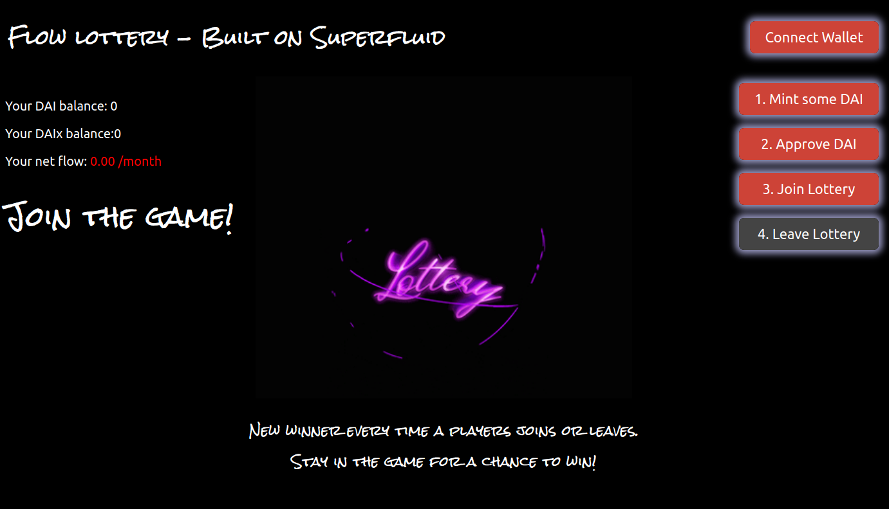

<h1 align="center">Welcome to flowlottery-superapp 👋</h1>
<p>
  <a href="#" target="_blank">
    
  </a>
  <a href="https://twitter.com/Superfluid_HQ" target="_blank">
    
  </a>
</p>

> Example Superfluid App using Constant Flow Agreements

Bootstrapped using [`create-eth-app`](https://github.com/paulrberg/create-eth-app)



## How it works

A game of chance built on Superfluid. Users join the game by sending a stream to our contract. All incoming streams are summed and the resulting reward stream is sent to the winner, until a new one is chosen!

Get a deep dive, including how we built it, in the blog post [Hacking on Superfluid](https://medium.com/superfluid-blog/hacking-on-superfluid-bbb9ade94f98).

### ✨ [Demo](https://flowlottery.eth.link/) on goerli

## Usage

To run the frontend using the deployed goerli contracts, skip the "Install Contracts" section and just run the frontend.

## Install Contracts

If you want to test + deploy contracts locally using ganache, run these commands:

```bash
yarn install
yarn build
yarn deploy
```

## Install Frontend

```bash

cd ui
yarn
yarn start
```

## Run tests

```bash
yarn test
```

## Author

👤 **Francesco Renzi**

-   Website: [https://superfluid.finance](https://superfluid.finance)
    -   Twitter: [@FrancescoRenziA](https://twitter.com/FrancescoRenziA)
    -   GitHub: [@kobuta23](https://github.com/kobuta23)

## Show your support

Give a ⭐️ if this project helped you!

---

_This README was generated with ❤️ by [readme-md-generator](https://github.com/kefranabg/readme-md-generator)_
