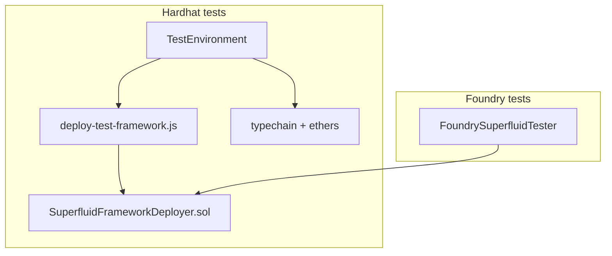

# Plan: Hardhat test harness modernization (drop Truffle, web3, js-sdk)

> **Planning doc** — frozen 2026-07-03. Not maintained after ship.
> Current usage: [packages/ethereum-contracts/README.md](../../README.md)

## Goal

Remove legacy Truffle/web3/js-sdk from the **Hardhat test harness** while keeping the same test coverage (Foundry + Hardhat suites in CI).

Target end state:

- **Deploy:** `dev-scripts/deploy-test-framework.js` + on-chain `SuperfluidFrameworkDeployer` (same as Foundry)
- **Interact:** ethers v5 + typechain (already used in most tests via `AgreementHelper`)
- **Delete:** `test/fixtures/hardhat-deploy/*`, `test/lib/superfluid-test-sdk.js`, `@nomiclabs/hardhat-truffle5`, `@nomiclabs/hardhat-web3`, js-sdk test dependency

## Problem

Hardhat tests boot through `TestEnvironment`, which today:

1. Runs `test/fixtures/hardhat-deploy/deploy-framework.js` (~1400 LOC ops-script port)
2. Initializes `@superfluid-finance/js-sdk` `Framework` for addresses + CFA helpers
3. Depends on `@truffle/contract`, global `web3`, and `hardhat-truffle5`'s `artifacts.require`

Foundry tests already use `SuperfluidFrameworkDeployer` in Solidity — no js-sdk, no Truffle.

## What we delete

| Artifact | Why |
|----------|-----|
| `test/fixtures/hardhat-deploy/deploy-framework.js` | Replaced by `deploy-test-framework.js` |
| `test/fixtures/hardhat-deploy/deploy-test-token.js` | Replaced by `SuperfluidFrameworkDeployer.deployWrapperSuperToken` |
| `test/fixtures/hardhat-deploy/deploy-super-token.js` | Same |
| `test/fixtures/hardhat-deploy/deploy-erc1820.js` | Inlined in `deploy-test-framework.js` |
| `test/lib/superfluid-test-sdk.js` | js-sdk re-export shim |
| `getScriptRunnerFactory` test path usage | Truffle exec runner; ops scripts keep their own path |
| `@nomiclabs/hardhat-truffle5` | Plugin only needed for `artifacts.require` |
| `@nomiclabs/hardhat-web3` | Replaced by `ethers.getSigners()` |
| `@decentral.ee/web3-helpers` `web3tx` in tests | Replaced by direct ethers calls + optional `test/lib/logged-tx.ts` |

## What we keep

| Artifact | Role |
|----------|------|
| `dev-scripts/deploy-test-framework.js` | Canonical ethers deployer (extend to return `getFramework()` addresses) |
| `TestEnvironment.ts` | Singleton harness; rewired to ethers-only bootstrap |
| `AgreementHelper.ts` | Already ethers-native |
| `@openzeppelin/test-helpers` `expectEvent` | Short-term; migrate to hardhat-chai-matchers incrementally where touched |
| Foundry suite | Unchanged |

## Architecture (after)

Both suites share the same on-chain deployer contract.

## Implementation phases

### Phase 1 — Default bootstrap (this PR)

1. Extend `deploy-test-framework.js` to return framework addresses from `getFramework()`.
2. Add `test/lib/logged-tx.ts`, `test/lib/cfa-flow.ts`, `test/lib/super-token-factory.ts`.
3. Rewrite `TestEnvironment.beforeTestSuite` to:
   - `deployTestFramework()` → load contracts via `ethers.getContractAt`
   - `frameworkDeployer.deployWrapperSuperToken(...)` for default `TEST` token
   - Remove js-sdk `Framework.initialize()`
4. Replace remaining `t.sf.*` call sites (~30 lines across 5 files).
5. Replace `web3tx` / `web3.utils` in `TestEnvironment` with ethers.
6. Remove hardhat-truffle5 and hardhat-web3 from `hardhat.config.ts`.

### Phase 2 — Variant deploy (Superfluid.test.ts)

`Superfluid.test.ts` has two contexts that need non-default host config:

- `nonUpgradable: true` + `useMocks: true`
- `appWhiteListing: true` + `useMocks: true`

Add `test/lib/deploy-variant-framework.ts` — ethers-only port of the **fresh-deploy** branch from old `deploy-framework.js` (mocks + constructor flags). Called only from `TestEnvironment.deployFramework(opts)` when opts differ from defaults.

### Phase 3 — Test file cleanup

- Replace `import { web3 } from "hardhat"` with `ethers.utils` across test files.
- Replace `web3tx(...)` with direct ethers or `loggedTx`.
- Remove `@decentral.ee/web3-helpers` from ethereum-contracts devDependencies when unused.

## Acceptance criteria

- [ ] `yarn test:contracts:hardhat` passes (full Hardhat suite) — WIP
- [ ] `yarn test:contracts:foundry` unchanged (green)
- [x] No `@nomiclabs/hardhat-truffle5`, `@nomiclabs/hardhat-web3` in ethereum-contracts `hardhat.config.ts`
- [x] No js-sdk import under `packages/ethereum-contracts/test/`
- [x] `test/fixtures/hardhat-deploy/` deleted
- [ ] CI feature workflow green on stacked PR

### Implementation note (2026-07-03)

Default bootstrap uses **`deploy-variant-framework.js`** (mock deploy via ethers) because tests expect `SuperfluidMock` / `SuperTokenMock`. Production path stays in `dev-scripts/deploy-test-framework.js`.

New helpers: `test/lib/ethers-framework.ts`, `deploy-mock-test-token.ts`, `web3-shim.ts`, `artifacts.js`, `logged-tx.ts`.

## Non-goals

- Removing `@openzeppelin/test-helpers` entirely (separate follow-up)
- Changing Foundry tests
- Rewriting production ops scripts under `scripts/ops-libs/` (still used by manual ops; separate from test harness)

## Risks

| Risk | Mitigation |
|------|------------|
| Superfluid.test variant deploy bitrot | Port only fresh-deploy path; keep parity tests |
| `expectEvent.inTransaction` expects tx hash shape | CFA helper returns `{ tx: transactionHash }` |
| Real vs mock SuperToken types | Use `SuperToken` typechain; mock-only tests use variant deploy |
