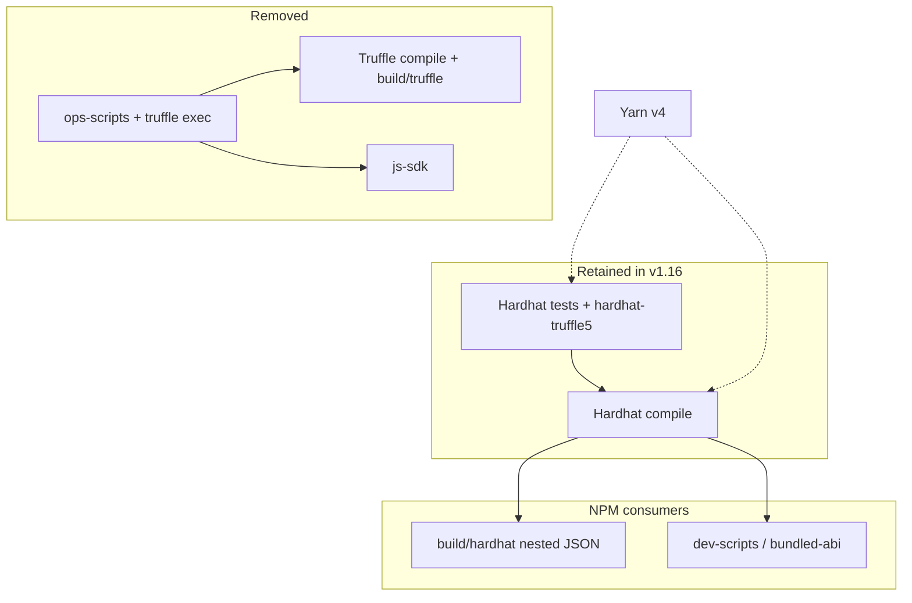

# Plan: ethereum-contracts v1.16.0 tooling modernization

> **Planning doc** — 2026-07-01 (revised). Describes proposed work for v1.16.0; not maintained after ship.
> Current usage docs: [README.md](../../README.md)

## Summary

v1.16.0 should modernize **developer/ops tooling** without changing on-chain protocol behavior. Three goals were named:

1. **Yarn v1 → v4** (monorepo-wide)
2. **Remove Truffle** from build, tests, and ops
3. **Deprecate js-sdk** (same milestone)

These are coupled but not identical in scope. Truffle removal is the highest-risk item for **npm consumers** and **ops workflows**. Yarn v4 is the highest-touch item for **the whole monorepo**. js-sdk removal from ethereum-contracts is tied to deleting legacy `ops-scripts/`; the **js-sdk package** itself is also deprecated in this milestone.

**Hardhat tests stay.** New work goes to Foundry, but the existing Hardhat/TS suite (~36 files, gated in CI via `yarn test`) is **not** slated for removal — the effort does not justify it.

**Ops scripts:** we do **not** need 1:1 replacements for every legacy script. Document gaps and port only what is still needed.

**Recommendation:** ship v1.16.0 as a sequence of PRs in a deliberate order (below). Remove `build/truffle/` from npm with a **deprecation notice** in CHANGELOG; consumers migrate to `build/hardhat/` or `build/bundled-abi.json`.

---

## Current state (investigation)

### Build toolchain

| Tool | Role today | Notes |
|------|------------|-------|
| **Foundry** | Primary for **new** tests (`test/foundry/`, 57 `.sol` files), contract lint, sizes, coverage | README positions Foundry as the default for new tests |
| **Hardhat** | Compiles to `build/hardhat/`, **retained** TS tests (36 files), `dev-scripts/`, coverage, docgen | Stays in CI; `paths.artifacts = build/hardhat` |
| **Truffle** | Compiles to flat `build/truffle/`, ops-scripts runner, bundled ABI, manual deploy workflows | To be removed |

`yarn build` currently runs **all three** compilers in parallel (`package.json` → `build:contracts:*`).

### npm package surface (`files` field)

Published today:

- `contracts/**` (minus mocks)
- `build/truffle/*.json` — **flat** artifacts — **to be removed in v1.16.0** (with deprecation notice)
- `build/hardhat/**` — **nested** artifacts — **canonical going forward**
- `build/bundled-abi.{js,json}`, `build/contracts-sizes.txt`
- `dev-scripts/**`, `utils/**`

`main` → `dev-scripts/index.js` (Hardhat/ethers deploy helpers; **no Truffle**).

`@truffle/contract` is listed in **production** `dependencies` but is **not used** by published `dev-scripts/` or `utils/`. Safe to drop.

### Truffle touchpoints (in-repo)

| Area | Files / usage |
|------|----------------|
| Compile | `truffle-config.js`, `build:contracts:truffle` |
| Hardhat bridge | `@nomiclabs/hardhat-truffle5` → `artifacts.require()` (~44 call sites); per-file migration is mechanical, but **`TestEnvironment.ts` is the gate** — see spike section |
| Ops | `ops-scripts/*` + `libs/truffleScriptRunnerFactory.js` |
| Post-build | `tasks/build-bundled-abi.sh` reads `build/truffle/<Name>.json` → switch to `build/hardhat/` |
| Verify / forwarder tasks | `tasks/*.sh` use `npx truffle exec` |
| CI (manual only) | See [CI workflows by trigger](#ci-workflows-by-trigger) |
| Root monorepo | `truffle` in root `devDependencies`; `js-sdk` tests via `truffle test` |

### js-sdk touchpoints

`@superfluid-finance/js-sdk` is a **devDependency** of ethereum-contracts, used in:

- Legacy `ops-scripts/*.js` (to be deleted)
- `test/TestEnvironment.ts` and `test/ops-scripts/deployment.test.js` — **refactor to drop js-sdk while keeping Hardhat tests**

The **js-sdk package** in the monorepo is **deprecated in v1.16.0** (sdk-core / `@sfpro/sdk` are the supported app path). Root `build-essentials:js-sdk` can be removed once dependents are gone.

### Ops scripts: old vs new

**`new-ops-scripts/`** (bash + Foundry `forge script` + `cast` + `safe-ops.ts`) covers operational tasks added in recent releases.

**`ops-scripts/`** (JS, Truffle exec) still covers framework deployment, testnet bootstrap, token listing, diagnostics, and flows not yet ported — but **full parity is not a goal**.

See [Appendix A: ops-scripts migration matrix](#appendix-a-ops-scripts-migration-matrix).

### Existing Foundry framework deploy work (unmerged)

WIP on branch **`remotes/origin/2025-11-tooling`** (commits from Oct 2025 tooling work):

| File | Role |
|------|------|
| `scripts/UpgradeFramework.s.sol` | Forge script for **framework upgrade** on live networks (loads existing host/resolver, deploys new logic, governance actions) |
| `scripts/utils/DeployUtils.sol` | Shared helpers: admin autodetect (EOA / Safe / multisig), governance/resolver action execution |
| `ops-scripts/upgrade-framework.sh` | Shell wrapper: metadata RPC, `HOST_ADDRESS` / `RESOLVER_ADDRESS`, `forge script … --account` |

Earlier WIP on branch **`xxx`**: `scripts/DeployFramework.s.sol` (~600 LOC) with `DEPLOYMENT_MODE=UPGRADE` — superseded by the refactor into `UpgradeFramework.s.sol` + `DeployUtils.sol`.

**Direction going forward:** do **not** replicate all of `deploy-framework.js` (~1300 LOC) in one script. Instead:

- Merge/port the tooling-branch work into `release_1.16.0`
- Split concerns: e.g. `UpgradeFramework.s.sol` (upgrade path), separate scripts for fresh deploy / testnet bootstrap / super-token deploy as needed
- Reuse `DeployUtils.sol` patterns already used by `GovAction.s.sol`

`SuperfluidFrameworkDeployer` (in contracts) remains the right tool for **local/test** deploys; production ops use the forge scripts + shell wrappers.

---

## CI workflows by trigger

Truffle-backed workflows are **all manually triggered** (`workflow_dispatch`). None run on `push` / `pull_request`. Automated CI does **not** depend on `truffle exec`.

### Automated (runs on PR / push / schedule)

| Workflow | Trigger | Truffle? |
|----------|---------|----------|
| `ci.feature.yml` | `pull_request`, `merge_group` | **No** — calls `call.test-ethereum-contracts.yml` → `yarn test` (Foundry + Hardhat) |
| `handler.publish-dev-release-packages.yml` | `push` to `dev`, `release` published | **No** — same test reusable workflow |
| `cd.packages-stable.create-release-drafts.yml` | `push` to `dev` (path-filtered) | **No** |
| `daily-query-check.yml` | `schedule` | **No** |

`yarn test` in ethereum-contracts runs Foundry + Hardhat suites. `test/ops-scripts/deployment.test.sh` (truffle exec) is a **local/package script**, not part of automated CI.

### Manual only (`workflow_dispatch`)

| Workflow | Truffle scripts used |
|----------|---------------------|
| `handler.deploy-to-mainnet.yml` | `deploy-framework.js` |
| `handler.deploy-to-testnets.yml` | `deploy-test-environment.js`, `info-print-contract-addresses.js` |
| `handler.run-ethereum-contracts-script.yml` | arbitrary `ops-scripts/` path |
| `handler.verify-contracts.yml` | `info-print-contract-addresses.js` |
| `handler.list-super-token.yml` | resolver list script |

### Reusable, no in-repo caller found

| Workflow | Truffle scripts | Notes |
|----------|-----------------|-------|
| `call.deploy-dry-run.yml` | `deploy-test-environment.js`, `gov-upgrade-super-token-logic.js` | `workflow_call` only; **no caller** in this repo (orphaned or invoked externally). Low priority unless revived. |

### Local `tasks/*.sh` (not CI)

`tasks/deploy-*-forwarder.sh`, `tasks/etherscan-verify-framework.sh` — still use truffle exec; migrate when those tasks are next used, or switch to existing `new-ops-scripts/`.

**Implication:** removing Truffle does **not** block merging v1.16.0 CI if automated tests pass. Manual deploy workflows can be updated incrementally or left broken-with-documented-alternative until the relevant forge script exists.

---

## Dependency graph



---

## Recommended order of work

### Phase 0 — Inventory & docs

1. Add **`docs/ops-scripts-migration.md`** with Appendix A + trigger context for CI.
2. CHANGELOG **deprecation notice** for `build/truffle/`, `ops-scripts/`, `@superfluid-finance/js-sdk`.

### Phase 1 — Build: drop Truffle compile, drop `build/truffle/` from npm

**Goal:** `yarn build` = Hardhat + Foundry only.

1. Point `tasks/build-bundled-abi.sh` at `build/hardhat/` (resolve nested paths by `contractName`).
2. Remove `build:contracts:truffle` and `truffle-config.js`.
3. Remove `build/truffle/` from `package.json` `files`; document migration:

   ```diff
   - require(".../build/truffle/Superfluid.json")
   + require(".../build/hardhat/contracts/superfluid/Superfluid.sol/Superfluid.json")
   ```

   Or use `build/bundled-abi.json` for ABI-only consumers (`scheduler-backend`, subgraph `getAbi.js`, wagmi configs).

4. Remove `@truffle/contract` from production `dependencies`.

**Known external `build/truffle/` consumers** (from repo scan): `scheduler-backend`, `subgraph/scripts/getAbi.js`, clearmacro-provider `wagmi.config.ts`. They need a heads-up or coordinated update; bundled-abi may be enough for ABI-only use cases.

### Phase 2 — Ops: merge tooling-branch work, delete legacy ops-scripts

**Goal:** Delete `ops-scripts/` when safe; **accept gaps** for rarely used scripts.

**Do first (high value, WIP exists):**

1. Merge `UpgradeFramework.s.sol` + `DeployUtils.sol` + `upgrade-framework.sh` from `2025-11-tooling` (adapt paths to `foundry-scripts/` layout if desired).
2. Update `handler.deploy-to-mainnet.yml` to use `upgrade-framework.sh` (or rename to `new-ops-scripts/`).
3. Switch `tasks/deploy-*-forwarder.sh` to existing `new-ops-scripts/` (already implemented on `dev`).

**Port only if still needed** (otherwise document gap):

- `info-print-contract-addresses.js` → metadata + `jq` / small script (unblocks verify workflow)
- `deploy-test-environment.js` → Foundry script for testnet bootstrap
- `gov-upgrade-super-token-logic.js` → only if `call.deploy-dry-run` is revived

**Explicitly accept gaps for now:** resolver list/register/unlist, super-token deploy scripts, info/diagnostic scripts, `gov-transfer-framework-ownership.js`, etc.

**Do not** block v1.16.0 on a monolithic `deploy-framework.js` port.

### Phase 3 — Remove Truffle tooling; keep Hardhat tests

**Goal:** No `truffle` package, no `truffle exec`, no `run-truffle`.

1. Remove root `truffle` devDep, `@d10r/truffle-plugin-verify`, `truffle-flattener`.
2. **hardhat-truffle5:** pulls deprecated `@nomiclabs/truffle-contract` → `@truffle/*` subtree (see research section). **Remove after `TestEnvironment` refactor** — not a long-term keep. Can remain only as interim if refactor slips; pin `@hh2`. Per-file test migration alone does not remove the plugin.
3. Refactor `TestEnvironment.ts` to drop js-sdk (typechain + metadata + existing ops module patterns, or inline helpers).
4. Delete `ops-scripts/` and `test/ops-scripts/deployment.test.sh` (truffle exec); keep or rewrite `deployment.test.js` as Hardhat-only if valuable.
5. Update README (remove `yarn run-truffle`, truffle-config references).

### Phase 4 — Deprecate js-sdk (same milestone)

1. Remove `@superfluid-finance/js-sdk` from ethereum-contracts `devDependencies` (after TestEnvironment refactor).
2. Mark `packages/js-sdk` deprecated in README; remove from root `build-essentials` / CI if nothing else requires it.
3. js-sdk's own `truffle test` suite goes away with the package — sdk-core covers app dev.

### Phase 5 — Yarn v4 (monorepo-wide)

See [Appendix B: Yarn v4 and `nodeLinker`](#appendix-b-yarn-v4-and-nodelinker).

Merge after Phases 1–3 are green (same release, separate PR).

---

## Consumer impact matrix

| Consumer pattern | v1.16.0 | Breaking? |
|------------------|---------|-----------|
| Solidity `import ".../contracts/..."` | unchanged | No |
| Foundry `forge install` | unchanged | No |
| Hardhat / `dev-scripts` (`build/hardhat/`) | unchanged | No |
| `build/truffle/Contract.json` | **removed** | **Yes** — migrate to `build/hardhat/...` or `bundled-abi.json` |
| `build/bundled-abi` | unchanged (sourced from hardhat) | No |
| `npx truffle exec ops-scripts/...` | **removed** | Yes for ops (documented) |
| Hardhat test consumers of the package | unchanged | No |

---

## js-sdk (v1.16.0)

**Deprecate in this milestone**, not “maybe later”:

- Remove from ethereum-contracts once `TestEnvironment` no longer needs it.
- Archive or freeze `packages/js-sdk`; stop publishing new versions when practical.
- sdk-core / `@sfpro/sdk` remain the supported path.

---

## Risks & mitigations

| Risk | Mitigation |
|------|------------|
| `build/truffle/` removal breaks downstream | Deprecation notice in v1.15.x CHANGELOG if possible; bundled-abi for ABI-only; list known consumers |
| Manual deploy workflows break | All manual-only; document `new-ops-scripts/` + `upgrade-framework.sh`; accept temporary gaps |
| Hardhat tests break without truffle compile | hardhat-truffle5 uses Hardhat artifacts, not truffle compile — verify in Phase 1 |
| `UpgradeFramework.s.sol` bitrots on `2025-11-tooling` | Merge early; rebase onto `release_1.16.0` |
| Yarn v4 breaks toolchain | Use `nodeLinker: node-modules` (see Appendix B) |

---

## Proposed PR breakdown

1. **docs + CHANGELOG:** deprecation notices; `docs/ops-scripts-migration.md`
2. **build:** drop truffle compile; bundled-abi from hardhat; remove `build/truffle/` from npm
3. **ops:** merge `UpgradeFramework` from `2025-11-tooling`; update mainnet workflow; delete `ops-scripts/`
4. **tests:** TestEnvironment without js-sdk; keep Hardhat suite green
5. **js-sdk:** remove package / build-essentials entry
6. **monorepo:** yarn v4 with `nodeLinker: node-modules`

---

## Acceptance criteria for v1.16.0

- [ ] `yarn build` does not invoke Truffle
- [ ] `yarn test` passes (Foundry **and** Hardhat suites)
- [ ] npm package does **not** contain `build/truffle/`; CHANGELOG documents migration
- [ ] `build/bundled-abi.json` still published and correct
- [ ] `ops-scripts/` removed; `docs/ops-scripts-migration.md` lists replacements and accepted gaps
- [ ] No `npx truffle exec` in repo (workflows, tasks, package scripts)
- [ ] `@superfluid-finance/js-sdk` removed from ethereum-contracts; js-sdk package deprecated
- [ ] `@decentral.ee/web3-helpers` moved from `dependencies` to `devDependencies` (full removal optional follow-on)
- [ ] Root monorepo on Yarn 4 (`nodeLinker: node-modules`) with CI green

---

## Appendix A: ops-scripts migration matrix

Legend: **Covered** | **Partial** | **Gap (accepted)** | **N/A**

We **do not** need to close all **Gap** rows before shipping. Implement when an ops need arises.

### Deployment

| Legacy script | Status | Replacement / notes |
|---------------|--------|---------------------|
| `deploy-framework.js` | **Partial** | `UpgradeFramework.s.sol` + `upgrade-framework.sh` on `2025-11-tooling` (upgrade path). Fresh deploy / full parity: **not required** for v1.16.0; add scripts incrementally. |
| `deploy-test-environment.js` | **Gap (accepted)** | Port if testnet workflow still used |
| `deploy-deterministically.js` | **Covered** | `new-ops-scripts/deploy-deterministic-forwarder.ts` (+ generalize later if needed) |
| `deploy-super-token.js` | **Gap (accepted)** | |
| `deploy-unlisted-*.js` | **Gap (accepted)** | |
| `deploy-test-token.js` | **N/A** | Foundry `TestToken` / dev-scripts |
| `deploy-erc1820.js` | **N/A** | dev-scripts / `ERC1820RegistryCompiled` |
| `deploy-aux-contracts.js` | **Gap (accepted)** | |
| `deploy-mfa.ts` | **N/A** | |

### Governance

| Legacy script | Status | Replacement / notes |
|---------------|--------|---------------------|
| `gov-set-token-min-deposit.js` | **Covered** | `gov-action.sh` |
| `gov-set-3Ps-config.js` | **Covered** | `gov-action.sh` |
| `gov-set-reward-address.js` | **Covered** | `gov-action.sh` |
| `gov-set-trusted-forwarder.js` | **Covered** | `gov-action.sh` / `activate-forwarder.sh` |
| `gov-upgrade-governance.js` | **Covered** | `gov-action.sh replaceGovernance` |
| `gov-transfer-framework-ownership.js` | **Gap (accepted)** | |
| `gov-authorize-app-deployer.js` | **Partial** | `acl-grant-superapp-registration.sh` — verify semantics |
| `gov-upgrade-super-token-logic.js` | **Gap (accepted)** | Only needed if dry-run workflow revived |

### Resolver / tokens / info

| Legacy script | Status | Notes |
|---------------|--------|-------|
| `resolver-set-key-value.js` | **Covered** | `resolver-set-key.sh` |
| `resolver-register/list/unlist-*.js` | **Gap (accepted)** | Manual workflows |
| `info-print-contract-addresses.js` | **Gap (accepted)** | Port if verify workflow still used |
| `info-*` (other) | **Gap (accepted)** | |
| `validate-deployment.ts` | **Partial** | Hardhat — keep, not truffle exec |
| `tmp-trigger-token-transfer.js` | **N/A** | Delete |

### CI & tasks (truffle exec)

| Target | Trigger | Priority |
|--------|---------|----------|
| `handler.deploy-to-mainnet.yml` | manual | P0 — `upgrade-framework.sh` |
| `handler.deploy-to-testnets.yml` | manual | P2 — port when next testnet deploy |
| `handler.run-ethereum-contracts-script.yml` | manual | P2 — restrict to `new-ops-scripts/` or remove |
| `handler.verify-contracts.yml` | manual | P2 |
| `handler.list-super-token.yml` | manual | P3 — gap accepted |
| `call.deploy-dry-run.yml` | reusable, no caller | P3 — orphan |
| `tasks/deploy-*-forwarder.sh` | local | P1 — use `new-ops-scripts/` |
| `tasks/etherscan-verify-framework.sh` | local | P2 |

---

## Appendix B: Yarn v4 and `nodeLinker`

### Recommendation: `nodeLinker: node-modules`

Use **traditional `node-modules`** for this monorepo, not PnP (default) or the `pnpm` linker.

```yaml
# .yarnrc.yml (proposed)
nodeLinker: node-modules
```

### Rationale (specific to protocol-monorepo)

| Factor | `node-modules` | `pnp` (Berry default) | `pnpm` linker |
|--------|----------------|----------------------|---------------|
| **Hardhat + plugins** | Works out of the box | Frequent resolution issues; needs unplugged deps / patches | Symlink edge cases |
| **`@nomiclabs/hardhat-truffle5`** | Compatible | Poor PnP support | Mixed reports |
| **webpack (js-sdk)** | Matches today's `nohoist` intent | Needs PnP plugin config | Symlinks can confuse older webpack resolvers |
| **`postinstall` symlinks** (`@openzeppelin-v5`, `aave-v3` → `lib/`) | Same model as Yarn v1 | Different layout; symlinks + PnP interact badly | Same symlink concerns |
| **Lerna + workspaces** | Well-trodden path | Extra IDE SDK / `yarn dlx` friction | Less common in this stack |
| **Nix CI shells** | Predictable paths for `node_modules/.bin` | `.pnp.cjs` loader must be wired everywhere | Moderate |
| **Ghost dependency detection** | Weaker | Stronger | Stronger |

Yarn's own docs position `node-modules` as the fallback when compatibility matters — which applies here. The monorepo is not a greenfield Node app; it is a **Hardhat + Foundry + legacy web3** toolchain with git submodules and custom `postinstall` wiring.

PnP's speed/disk benefits are real but the cost is debugging tools that walk `node_modules` manually (common in older Ethereum tooling). The `pnpm` linker is a middle ground but still uses symlinks/hardlinks that have historically caused friction with Hardhat and some bundlers — without enough upside over `node-modules` for this repo.

### Not recommended for v1.16.0

- **`nodeLinker: pnp`** — highest risk for Hardhat, truffle-era plugins, and contributor DX.
- **Switching to actual pnpm** — out of scope; Yarn v4 with `node-modules` is the incremental win.

### Migration checklist

- [ ] `packageManager: "yarn@4.x.x"` + `.yarn/releases/`
- [ ] `.yarnrc.yml` with `nodeLinker: node-modules`
- [ ] Replace `workspaces.nohoist` (js-sdk webpack): test with plain hoisting under `node-modules`; use `dependenciesMeta` only if webpack breaks
- [ ] Validate `postinstall` symlinks to `lib/` still work
- [ ] CI: `yarn install --immutable`; cache `.yarn/cache`
- [ ] Nix `ci-default` / `ci-node22` smoke test
- [ ] Document Corepack setup for contributors

---

## Open questions

1. **`UpgradeFramework.s.sol` merge:** land under `foundry-scripts/` or keep `scripts/` path from tooling branch?
2. **`build/truffle/` deprecation:** one release notice in v1.15.x patch, or only in v1.16.0 CHANGELOG?
3. **`call.deploy-dry-run.yml`:** delete orphan workflow or keep for external invocation?
4. **js-sdk npm publish:** last release with deprecation banner, or unpublish skip?

---

## `hardhat-truffle5` (not just a shim)

**What it is:** ~660 LOC Hardhat 2 plugin bridging Hardhat artifacts → `@nomiclabs/truffle-contract` instances; injects `artifacts.require()`, global `contract()`, chai globals. Uses `hardhat-web3` + web3 v1. Does **not** need Truffle CLI or `truffle compile`.

**Maintenance:** HH2 line alive (`2.1.2`, Oct 2025, dist-tag `hh2`). npm `latest` (`3.0.0`, Feb 2026) is an intentional kill-switch. No Hardhat 3 path.

**Nested deps (confirmed via `npm ls`):** `hardhat-truffle5` → `@nomiclabs/truffle-contract@4.5.10` → npm-**deprecated** `@truffle/blockchain-utils`, `@truffle/contract-schema`, `@truffle/debug-utils`, `@truffle/interface-adapter`, `@truffle/error@0.1.1` (duplicate line vs 0.2.2 elsewhere), `ethereum-ens@0.8.0` (only under this fork), legacy `ethers@4` + `web3@1`. **Keeping the plugin means keeping this deprecated subtree** — the repo already has a *second* deprecated contract stack alongside prod `@truffle/contract@4.6.31`.

**Removing only hardhat-truffle5** (after `TestEnvironment` refactor) drops: both NomicLabs packages, `@truffle/error@0.1.1`, `ethereum-ens@0.8.0`, `fs-extra@7`, `@types/chai@4` — **not** the bulk of `@truffle/*` / `web3@1` (those stay via root `truffle`, prod `@truffle/contract`, `@openzeppelin/test-helpers`, `hardhat-web3`, verify plugin, js-sdk).

**v1.16.0:** Pin `@hh2`. Treat plugin as **short-term bridge only** — schedule removal with `TestEnvironment` refactor; full deprecated-stack cleanup also requires dropping root `truffle`, prod `@truffle/contract`, OZ test-helpers, js-sdk.

---

## Spike: hardhat-truffle5 migration

**File migrated:** `test/contracts/tokens/PureSuperToken.test.ts`

**Before/after patterns:**

| Truffle5 / web3 | Hardhat-idiomatic |
|-----------------|-------------------|
| `const X = artifacts.require("X")` | `ethers.getContractAt("X", address)` or typechain import |
| `await X.at(address)` | `await ethers.getContractAt("X", address)` |
| `await web3tx(fn, "label")(...args)` | `await fn(...args)` (ethers signer is implicit default account) |
| `ethers.getContractFactory` | unchanged — already used for deploy |

**Effort assessment:** **moderate** for this file (small surface, but still coupled to `TestEnvironment` with `isTruffle: true` and js-sdk). The `artifacts.require` / `Contract.at` / `web3tx` replacements themselves are **mechanical**; the non-mechanical part is `TestEnvironment.ts` (2 `artifacts.require` sites, js-sdk, global `web3`) and files that mix truffle contract instances with `@openzeppelin/test-helpers` `expectEvent.inTransaction`.

**Blockers discovered:**

- `TestEnvironment.ts` still requires `artifacts.require("SuperTokenMock")` and `TestToken` — every test that calls `beforeTestSuite({ isTruffle: true })` indirectly depends on hardhat-truffle5 until TestEnvironment is refactored.
- `web3tx` from `@decentral.ee/web3-helpers` is pervasive (~most token/agreement tests); dropping it is a separate sweep from `artifacts.require`.
- `SETH.test.ts`, `deployment.test.js`, and agreement tests use `expectEvent.inTransaction(tx.tx, truffleContract, ...)` which expects truffle contract ABIs.
- `deployment.test.js` uses `contract(...)` truffle test wrapper and `.call()` / `.detectNetwork()` patterns — hardest file to migrate.

**Full-suite estimate (if hardhat-truffle5 removed entirely):**

- ~46 `artifacts.require` call sites across 9 test files (+ `TestEnvironment.ts`).
- ~36 Hardhat test files total; ~10 still import truffle artifacts.
- Per-file migration like this spike: **15–30 min** when already partially on ethers; **1–2 h** for heavily web3tx/event-coupled files (`SETH.test.ts`, `deployment.test.js`, agreement callbacks).
- Removing hardhat-truffle5 is **not** blocked by individual test migrations alone — **TestEnvironment refactor** is the gating item (~1–2 days). Incremental per-file migration is feasible without blocking v1.16.0.

---

## `@decentral.ee/web3-helpers`

Used only in Hardhat tests and legacy `ops-scripts/` (not in published `dev-scripts/`). Currently **mislisted as a production dependency** — all usage is test/ops-only.

`web3tx` (~114 call sites) logs gas and normalizes return shape via `global.web3`; it is independent of Truffle compile and `hardhat-truffle5`, but coupled to `expectEvent.inTransaction(tx.tx, …)` (~35 sites). Ops-script deletion removes ~40% of `web3tx` usage.

**Dependency tree:** runtime dep is only `web3-utils`; peer is `@openzeppelin/test-helpers`. **Removing web3-helpers drops just that one package** — not truffle, web3 v1, test-helpers, or `@truffle/contract` (those stay via root deps, hardhat-truffle5, js-sdk, direct test imports). Weak lever for pruning deprecated stack.

**v1.16.0 minimum:** move to `devDependencies`. **Full removal:** separate test sweep (~1–2 days), best bundled with `TestEnvironment` refactor — not a release blocker. Real deprecated-package pruning = Truffle removal + test-helpers → hardhat matchers + js-sdk deprecation.

---

## Suggested immediate next steps

1. Rebase `remotes/origin/2025-11-tooling` onto `release_1.16.0` and assess `UpgradeFramework.s.sol` merge effort.
2. Create `docs/ops-scripts-migration.md` from Appendix A.
3. Phase 1 spike: `build-bundled-abi.sh` reading from `build/hardhat/`.
4. Add CHANGELOG deprecation entries for `build/truffle/`, `ops-scripts/`, js-sdk.
